<h1 align="center">👩🏻‍💻 Olá, eu sou o Gabriel Haruo</h1>

<p align="center">
  <strong>Desenvolvedor Front-end Pleno</strong> em evolução para <strong>Fullstack</strong>.<br/>
  Construindo aplicações web modernas, escaláveis e bem estruturadas com React, Next.js, TypeScript e APIs robustas.
</p>

<p align="center">
  <a href="https://github.com/gharuo">
    
  </a>
  <a href="https://www.linkedin.com/in/gabriel-haruo-chiyoshi">
    
  </a>
  <a href="mailto:gharuod3v@gmail.com">
    
  </a>
</p>

---

## 🚀 Sobre mim

Sou um desenvolvedor focado em criar interfaces performáticas, acessíveis e fáceis de manter.

Atualmente atuo com **Front-end**, principalmente usando **React, Next.js, TypeScript e TailwindCSS**, e estou expandindo minha atuação para o lado **Fullstack**, estudando e criando projetos com **Node.js, C#, .NET, PostgreSQL, Prisma e Docker**.

Meu foco é construir aplicações completas: da interface ao banco de dados, passando por autenticação, APIs, regras de negócio, arquitetura, testes e deploy.

---

## 🤖 Tecnologias que trabalho


## 🧠 Atualmente estudando

```ts
const currentFocus = {
  frontend: ["React", "Next.js", "TypeScript", "TailwindCSS", "shadcn/ui"],
  backend: ["Node.js", "Fastify", "C#", ".NET", "REST APIs"],
  database: ["PostgreSQL", "Prisma", "SQL Server"],
  architecture: ["Clean Architecture", "MVVM", "Repository Pattern", "BFF"],
  quality: ["Vitest", "Testing Library", "ESLint", "CI/CD"],
};

```

## 🤖 Estatisticas 

<p>
      
</p>
